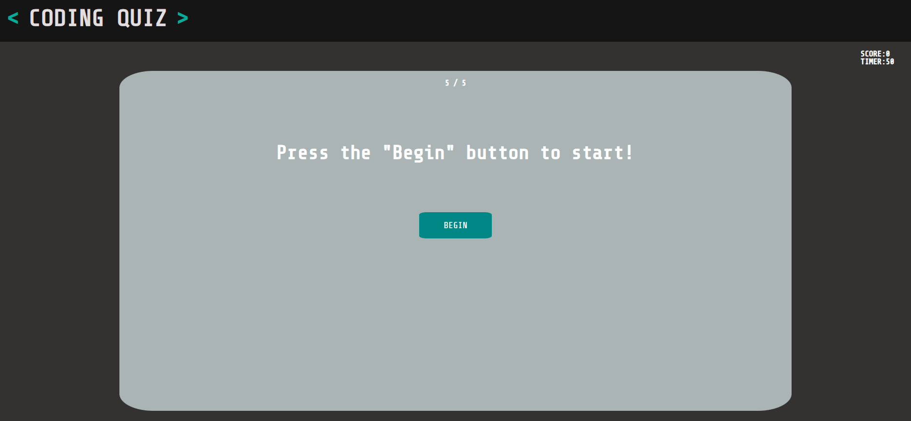
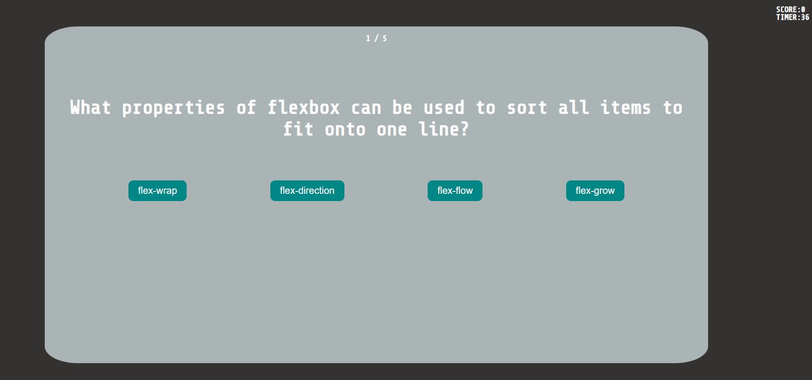
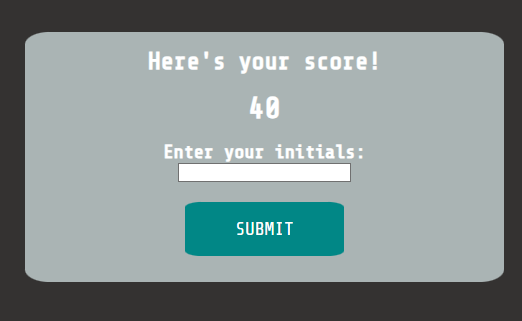
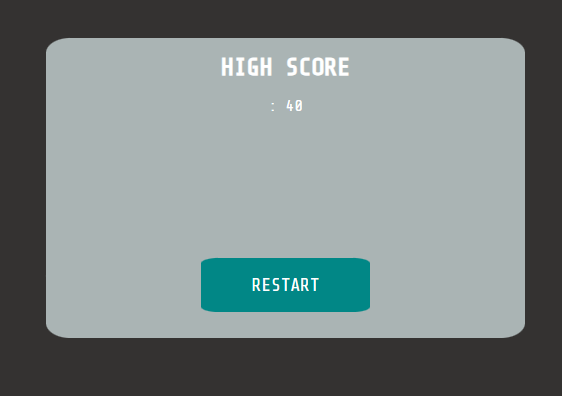

# Coding Quiz

## Description

There is a lot of topics that is taught through the boot camp and this website was built to allow boot camp students to test their understanding of topics they have learned throughout the week. Through this website, students are able to put their knowledge to the test and be timed on how well thay do. While building this quiz, I was able to learn how to style a functioning quiz through javascript and use the tools I was taught. 

## Table of Contents (Optional)

- [Installation](#installation)
- [Usage](#usage)
- [Credits](#credits)
- [License](#license)

## Installation

N/A

## Usage

Website: 


When the user enters the browser, they will see the front page of the site and a blue button saying "Begin". The user will need to click on the button to start the quiz. When they do, the quiz will begin with the first question randomly generated and the timer will count down from 50 seconds. Each question they go through that the user answers right will get 20 points and the screen will turn green. However, if they answer wrong, the scene will turn red and the timer will go down 10 seconds. If they run out of time or all questions are answered, the user is taken to the score board to enter their own initials and see their total score. After they click submit, they are taken to the leaderboard to see their score displayed and can restart the quiz to see if they can do better. Their previous score will be saved and displayed after thry complete the quiz again.

    ```md
    
    ```
    ```md
    
    ```
    ```md
    
    ```

## Credits

N/A

## Codes Used

The code for the challenge can be found in the following file:

- [script.js](/src/script.js): Contains the Javascript code of the landing page.

- [script.js](/src/script.js) LINE 115 - 132: Based on the work of [Mozilla Foundation](https://developer.mozilla.org/en-US/docs/Web/API/setTimeout)

```
    setTimeout(() => {
                card.style.backgroundColor = "";
            }, 500); 

            // When the answer is correct, add 20 points to score
            scoreCounter += 20;
            scoring.textContent = scoreCounter;

```

- [script.js](/src/script.js) LINE 66 - 74: Based on the work of [Refsnes Data](https://www.geeksforgeeks.org/shuffle-a-given-array-using-fisher-yates-shuffle-algorithm/#)

```
    // Start from the last index of the array and swap one by one
    for (let i = arr.length - 1; i > 0; i--) {
    
      // Pick a random index in the array from 0 to i
      const randomIndex = Math.floor(Math.random() * (i + 1));

      // Swap the arr[i] and arr[randomIndex] vice versa at random
      [arr[i], arr[randomIndex]] = [arr[randomIndex], arr[i]];
    }
```

## License

N/A

## Badges

N/A

## Features

N/A

## How to Contribute

N/A

## Tests

N/A